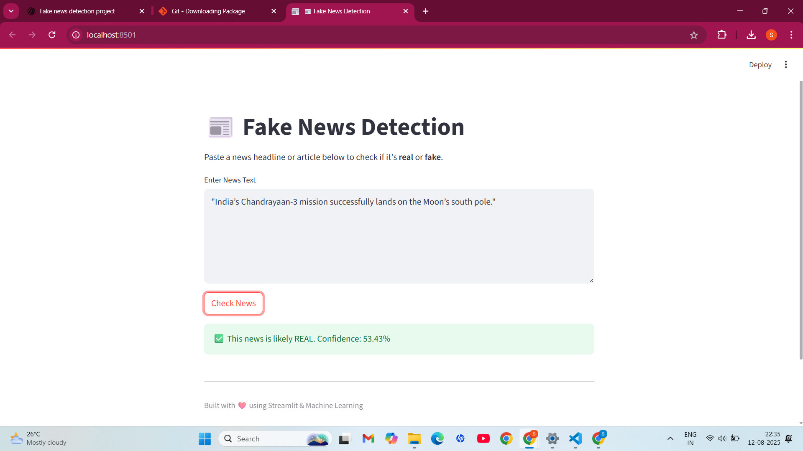
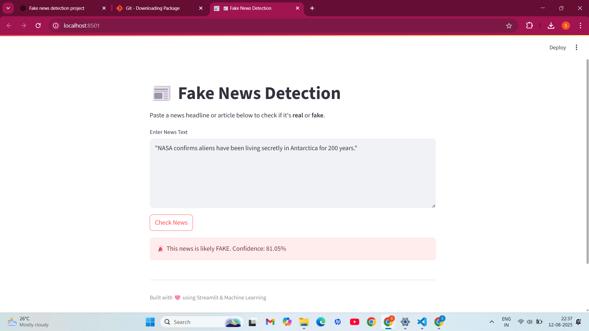

 README.md:
---

```markdown
# 📰 Fake News Detection

A machine learning project that detects whether a news article is **Fake** or **True** based on its content.  
This project uses Natural Language Processing (NLP) techniques and a trained machine learning model to classify news articles with high accuracy.

---

## 📌 Features
- Preprocesses news headlines and articles.
- Uses a trained ML model (`model.pkl`) and vectorizer (`vectorizer.pkl`).
- Classifies input text as **FAKE** or **REAL**.
- Built with **Python**, **scikit-learn**, and **Flask**.

---

## 📂 Project Structure
```

fake\_news\_detection/
│-- app.py              # Web application script
│-- main.py             # Main ML training/testing script
│-- Fake.csv            # Dataset of fake news articles
│-- True.csv            # Dataset of real news articles
│-- model.pkl           # Trained model
│-- vectorizer.pkl      # Text vectorizer
│-- requirements.txt    # Python dependencies
│-- demopic.png         # Demo screenshot (real news example)
│-- demopicfake.png     # Demo screenshot (fake news example)
│-- README.md           # Project documentation

````

---

## 📊 Dataset
- **Fake.csv** → Contains fake news articles.
- **True.csv** → Contains real news articles.  
> **Note:** Files are large (>50MB) and stored in this repository.  
> Dataset source: [Kaggle Fake and Real News Dataset](https://www.kaggle.com/clmentbisaillon/fake-and-real-news-dataset)

---

## ⚙️ Installation
1. **Clone the repository:**
```bash
git clone https://github.com/charishmasai99/fake_news_detection.git
cd fake_news_detection
````

2. **Install dependencies:**

```bash
pip install -r requirements.txt
```

---

## 🚀 Usage

Run the Flask app:

```bash
python app.py
```

Then open [http://127.0.0.1:5000](http://127.0.0.1:5000) in your browser.

---

## 📸 Demo

### ✅ Real News Example



### ❌ Fake News Example



---

## 📈 Model

* **Algorithm:** Logistic Regression / Naive Bayes (choose your final model)
* **Vectorization:** TF-IDF
* **Accuracy:** \~XX% (replace with actual score)

---

## 🛠 Technologies Used

* Python
* Pandas, NumPy
* Scikit-learn
* Flask
* HTML/CSS (for UI)

---

## 📌 Future Improvements

* [ ] Deploy online using Heroku/Render/Streamlit.
* [ ] Add real-time news scraping.
* [ ] Enhance preprocessing with advanced NLP (BERT, transformers).

---

## 🤝 Contributing

Pull requests are welcome. For major changes, open an issue first to discuss your ideas.

---

## 📜 License

This project is open-source under the MIT License.


